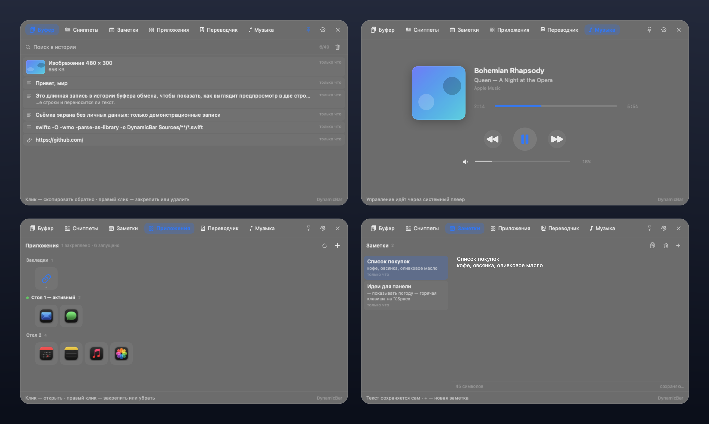
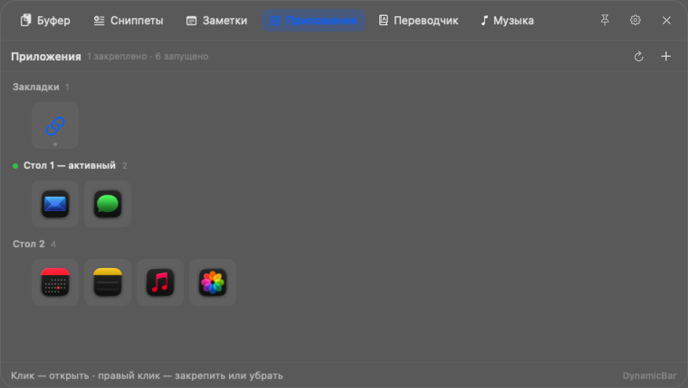
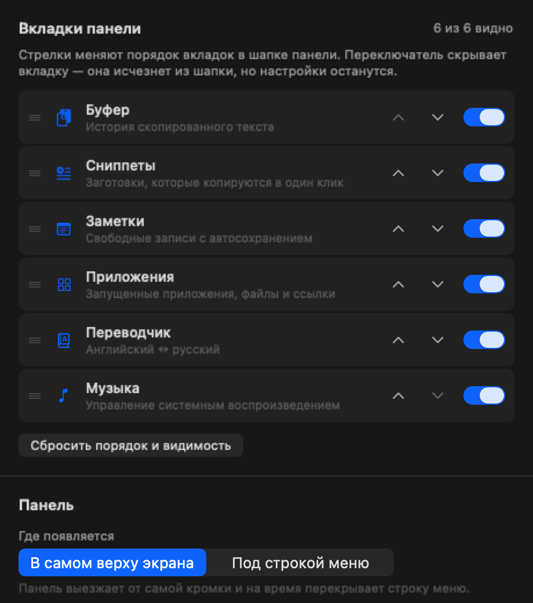

# DynamicBar

Нативная выезжающая панель для macOS в духе [Cyclop](https://github.com/akalikbergenov/cyclop):
буфер обмена, сниппеты, заметки, запущенные приложения, переводчик и управление музыкой —
в одном окне, которое появляется от самой кромки экрана и исчезает, когда курсор уходит.

Написано на Swift + AppKit/SwiftUI. Без Electron, без Xcode-проекта, без сторонних зависимостей:
собирается только Command Line Tools.



---

## Содержание

- [Что умеет](#что-умеет)
- [Скачать и запустить](#скачать-и-запустить)
- [Сборка из исходников](#сборка-из-исходников)
- [Если macOS блокирует запуск](#если-macos-блокирует-запуск)
- [Настройки](#настройки)
- [Как это устроено](#как-это-устроено)
- [Диагностика](#диагностика)
- [Структура проекта](#структура-проекта)
- [Известные ограничения](#известные-ограничения)

---

## Что умеет

| Вкладка | Что делает |
|---|---|
| **Буфер** | До 40 записей — текст и **картинки**. Клик копирует обратно, поиск, закрепление, удаление, миниатюры. Пароли и «concealed» данные не записываются. |
| **Сниппеты** | Заготовки текста: добавить, изменить, удалить, скопировать одним кликом. |
| **Заметки** | Список и редактор рядом, автосохранение по мере набора, копирование заметки целиком. |
| **Приложения** | Иконки запущенных приложений без подписей и закладки. **Три режима** (см. ниже), закрепление, «+» — добавить файл или ссылку. |
| **Переводчик** | Английский ↔ русский, направление определяется по тексту. Три источника: Яндекс (нужен ключ), Google (без ключа), встроенный macOS. |
| **Музыка** | Обложка, название, исполнитель, альбом, живой прогресс с перемоткой, ⏮ ⏯ ⏭, ползунок громкости и кнопка mute. |

### Вкладка «Приложения»: три режима

Переключаются в настройках.



1. **Все** — все запущенные приложения и все закладки сплошной сеткой.
2. **Активный стол** — закладки и только те приложения, у которых есть окно на текущем
   рабочем столе.
3. **По столам** — закладки, а дальше приложения разложены по рабочим столам: активный
   первым и помечен зелёной точкой, пустые столы не показываются. Клик по приложению с
   другого стола **переносит на этот стол**.

Список столов и то, какие окна на них живут, macOS через публичные API не отдаёт, поэтому
используются приватные вызовы SkyLight (`CGSCopyManagedDisplaySpaces`,
`CGSCopyWindowsWithOptionsAndTags`, `CGSManagedDisplaySetCurrentSpace`). Разрешений это не
требует. Если Apple уберёт символы, вкладка не сломается — она вернётся к режиму «все».

Раскладка сверяется с публичным списком видимых окон: `--spacetest` сравнивает приложения
активного стола, полученные приватным API, с тем, что показывает обычный
`CGWindowListCopyWindowInfo`. Оба источника должны совпадать — иначе раскладке нельзя верить.

Плюс к этому:

* **Невидимая зона наведения** 180 × 24 pt в верхнем центре экрана — панель выезжает сама.
* **Иконка в menu bar**: левый клик — открыть/закрыть, правый — меню с настройками и выходом.
  Иконку можно **скрыть** — настройки тогда открываются шестерёнкой в шапке панели (⌘,).
* **Настройки всегда достижимы.** Приложение не даст выключить и наведение, и иконку сразу:
  один из двух способов открыть настройки останется. Испорченное сочетание настроек
  чинится само при запуске.
* **Настраиваемые вкладки**: порядок меняется перетаскиванием или стрелками, ненужные скрываются.
* **Автозапуск** при входе в систему.
* **Ни одного системного разрешения.** Приложение не просит ни Accessibility, ни Automation,
  ни запись экрана, ни доступ к календарю.

---

## Скачать и запустить

Готовое приложение лежит в репозитории: `dist/DynamicBar.app`.

```bash
git clone <адрес-репозитория> DynamicBar
cd DynamicBar
open dist/DynamicBar.app
```

Либо перетащите `DynamicBar.app` в `/Applications`.

Требования: **macOS 13 или новее**, процессор Intel или Apple Silicon. Собранный бинарник —
`x86_64`; универсальный собирается командой `ARCHS="x86_64 arm64" ./scripts/build.sh`.

---

## Сборка из исходников

Нужны только **Command Line Tools** — полноценный Xcode не требуется.

```bash
xcode-select --install     # если ещё не установлены
cd DynamicBar
./scripts/build.sh         # соберёт build/DynamicBar.app
open build/DynamicBar.app
```

Полезные команды:

```bash
./scripts/run.sh                          # пересобрать и перезапустить
./scripts/verify.sh                       # 71 автоматическая проверка
ARCHS="x86_64 arm64" ./scripts/build.sh   # универсальный бинарник
pkill -f DynamicBar.app                   # выйти
```

Скрипт сборки делает две вещи: компилирует Swift-исходники через `swiftc` и собирает
`libdynamicbarmedia.dylib` через `clang` (см. [Как это устроено](#как-это-устроено)).

---

## Если macOS блокирует запуск

Приложение подписано **ad-hoc** — без Developer ID и без нотаризации Apple, поэтому при первом
запуске возможно предупреждение «Apple не может проверить…». Это нормально для проекта,
который собирается локально.

Любой из вариантов:

1. **Правый клик → «Открыть»** по `DynamicBar.app`, затем «Открыть» в диалоге.
2. **Системные настройки → Конфиденциальность и безопасность** → внизу строка про
   заблокированное приложение → **«Всё равно открыть»**.
3. Если файл помечен карантином (например, скачан браузером):

```bash
xattr -dr com.apple.quarantine DynamicBar.app
open DynamicBar.app
```

---

## Настройки

Правый клик по иконке в menu bar → **«Настройки…»**.



* порядок вкладок (перетаскивание или стрелки ↑↓) и их видимость;
* где появляется панель: от кромки экрана (перекрывает строку меню) или сразу под ней;
* анимация появления: пружинная или **без анимации** — для слабого железа;
* открывать ли панель при наведении на верхний центр;
* размер зоны наведения (ширина и высота);
* режим вкладки «Приложения»: все / активный стол / по столам;
* показывать ли иконку в строке меню (шестерёнка в панели остаётся запасным входом);
* автозапуск, кнопки «Открыть журнал» и «Папка данных»;
* источник перевода и ключ Яндекса.

Окно настроек компактное (460 × 520) и целиком прокручивается — раньше оно было выше
экрана и низ уходил под Dock. Размер можно растянуть мышью, он запоминается.

Последнюю видимую вкладку скрыть нельзя — панель без вкладок выглядела бы сломанной.

---

## Как это устроено

### Музыка: обход ограничения macOS

Начиная с macOS 15.4 `mediaremoted` отвечает только доверенным клиентам. Обычное приложение
получает `kMRMediaRemoteFrameworkErrorDomain Code=3 "Operation not permitted"` на любой запрос
о текущем треке. Объявить нужный entitlement нельзя: он restricted, и процесс, который его
заявляет без разрешения Apple, убивается при запуске (`Killed: 9`).

Решение — то же, что придумали в Cyclop: **dylib загружается внутрь `/usr/bin/perl`**.
Это платформенный бинарник, которому демон доверяет, и он подписан без library validation,
поэтому может загрузить наш код. Вызовы MediaRemote выполняются внутри этого процесса и
возвращают полную запись: название, исполнителя, альбом, длительность, позицию, обложку и
список команд, которые плеер принимает прямо сейчас.

```
DynamicBar.app
├── Contents/MacOS/DynamicBar
└── Contents/Resources/libdynamicbarmedia.dylib   ← грузится в perl
```

```
DynamicBar  ──stdin (get / cmd N / seek N)──▶  perl + libdynamicbarmedia.dylib  ──▶ MediaRemote
            ◀──stdout (по одному JSON в строке)──                              ◀── mediaremoted
```

Детали, которые пришлось учесть:

* хелпер опрашивает состояние раз в секунду **и** подписан на уведомления MediaRemote —
  на macOS 26 уведомления приходят ненадёжно, поэтому опрос не роскошь, а необходимость;
* команды уходят конкретному активному плееру через `MRMediaRemoteSendCommandToPlayer`, а
  список поддерживаемых команд берётся из `GetSupportedCommandsForPlayer` — поэтому кнопки
  ⏮ ⏭ гаснут там, где плеер их не принимает (например, одиночное видео в браузере);
* `elapsed` приходит вместе с отметкой времени, потому что демон отдаёт замер, а не бегущие
  часы — приложение «старит» замер само, поэтому полоса прогресса движется плавно;
* хелпер завершается, как только закрывается stdin, — он не может пережить приложение;
* если `/usr/bin/perl` исчезнет, приложение не упадёт: оно переключится на прямые вызовы
  MediaRemote, а затем на чтение заголовка окна медиаплеера.

**Данные из Now Playing — чужие.** Их заполняет тот, кто написал страницу или трек, поэтому
текст обрезается до 512 символов и очищается от управляющих символов и bidi-подстановок,
а обложка ограничена 4 МБ до передачи в системный декодер изображений.

### Панель: почему нет окна над строкой меню

Классический подход «прозрачное окно поверх меню-бара» ломает клики по самому меню-бару.
Здесь окна нет вообще: позиция курсора читается через `NSEvent` global monitor плюс
watchdog 30 Гц. Поэтому **клики по строке меню работают всегда** — когда панель скрыта,
у процесса ноль окон на экране (это проверяется автоматически через `CGWindowListCopyWindowInfo`).

* **Панель не забирает фокус.** `NSPanel` со стилем `.nonactivatingPanel`. Активация
  происходит только если пользователь реально кликнул внутри (поиск, редактор заметки) и
  снимается при скрытии панели.
* **Позиция.** По умолчанию панель начинается от самой кромки экрана (y = 0) и на время
  перекрывает строку меню: её уровень 26, выше меню (24–25). Выпадающие меню (101+) и
  системные оповещения остаются сверху. В настройках можно переключить на «под строкой меню».
* **Анимация.** Не кривая Безье, а численная пружина: кадры приходят от `CADisplayLink`,
  а шаг интегрирования берётся из фактического интервала между кадрами. Фиксированный шаг
  при неравномерном таймере давал видимые ступеньки. Когда окно полностью уходит за край
  экрана, дисплей-линк замолкает — поэтому рядом всегда работает сторожевой таймер, иначе
  пружина замирала в последних долях пункта и панель не убиралась.
* **Клик по приложению.** Используется `NSWorkspace.openApplication(activates: true)` — для
  уже запущенного приложения это ровно то, что делает клик по его иконке в Dock, включая
  разворачивание свёрнутого окна. Обычный `activate` окно не разворачивает.

### Приватность

* В историю буфера не попадает всё, что помечено `org.nspasteboard.ConcealedType`
  (менеджеры паролей), `TransientType`, `AutoGeneratedType` и известными маркерами
  популярных менеджеров паролей. Содержимое, скопированное самим DynamicBar, не перезаписывается.
* Файлы данных лежат в `~/Library/Application Support/DynamicBar` с правами `600`.
* Сеть используется только переводчиком, и только когда выбран источник Google или Яндекс.
* Ключ Яндекса хранится в `UserDefaults` вместе с остальными настройками.

---

## Диагностика

```bash
BIN=build/DynamicBar.app/Contents/MacOS/DynamicBar

$BIN --selftest        # macOS, экраны, строка меню, hotspot, символы MediaRemote, громкость, пути
$BIN --storetest       # 97 проверок: буфер, картинки, сниппеты, заметки, вкладки, приложения, переводчик, доступ к настройкам, раскладка по столам
$BIN --musictest       # что играет сейчас (+ --toggle: проверить play/pause и вернуть как было)
$BIN --translatestest  # реальные запросы перевода (+ --builtin: встроенный, до 45 с)
$BIN --animtest        # измерить кадры анимации
$BIN --activationtest  # проверить, что клик по приложению выводит его вперёд
$BIN --showtest        # показать/скрыть панель и напечатать её окно глазами window-сервера
$BIN --settingstest    # открыть настройки: размер, попадание на экран и работа прокрутки
$BIN --geartest        # спрятать иконку в строке меню и проверить, что настройки доступны
$BIN --spacetest       # рабочие столы и раскладка приложений (+ --switch: проверить переход)
$BIN --rendertest DIR  # отрендерить все вкладки в PNG
$BIN --screenshot DIR  # то же, но с демонстрационными данными (для картинок в README)
DYNAMICBAR_DEBUG=1 $BIN   # подробный журнал
```

`./scripts/verify.sh` прогоняет всё это автоматически — **71 проверка**. Скрипт двигает
настоящий курсор в зону наведения, читает журнал медиа-демона и список окон window-сервера,
то есть проверяет поведение, а не только сборку.

---

## Структура проекта

```
Sources/DynamicBar/
├── Entry.swift                 @main + режимы диагностики
├── AppDelegate.swift           сборка приложения, single-instance, тестовые режимы
├── AppState.swift              вкладки, размещение, анимация, настройки
├── TabSettings.swift           порядок и видимость вкладок
├── SettingsWindowController.swift
├── SelfTest / StoreTest / RenderTest / ScreenshotTest / Diagnostics
├── Panel/
│   ├── PanelWindow.swift       NSPanel: borderless, nonactivating, уровень 26
│   ├── PanelController.swift   геометрия, состояние hover, фокус, размещение
│   ├── SpringAnimation.swift   пружина на кадрах дисплея + сторожевой таймер
│   └── HotspotMonitor.swift    global mouse monitor + watchdog
├── Services/
│   ├── MediaHelperFeed.swift   запуск perl + dylib, JSON-протокол
│   ├── NowPlayingService.swift состояние плеера, старение позиции, команды
│   ├── SystemVolume.swift      системная громкость и mute через CoreAudio
│   ├── AppActivator.swift      вывод чужого приложения вперёд
│   ├── AppsStore.swift         закреплённые приложения, файлы, ссылки
│   ├── AppsGrouping.swift      три режима вкладки «Приложения» (чистая логика)
│   ├── SpacesService.swift     рабочие столы через приватные API SkyLight
│   ├── ClipboardStore.swift    история буфера и правила приватности
│   ├── SnippetStore.swift      сниппеты
│   ├── NoteStore.swift         заметки
│   ├── TranslationService.swift Яндекс / Google / встроенный источник
│   ├── BuiltInTranslator.swift невидимое окно для Translation framework
│   ├── WindowTitleProbe.swift  запасной источник метаданных
│   └── LaunchAtLogin.swift     SMAppService + LaunchAgent fallback
├── Status/StatusItemController.swift
└── Views/                      PanelRootView и вкладки + SettingsView

Sources/DynamicBarMediaHelper/helper.m   dylib для загрузки в /usr/bin/perl
scripts/build.sh                          сборка .app и dylib
scripts/verify.sh                         автоматические проверки
scripts/tools/warp.swift                  двигает курсор для проверки hover
scripts/tools/make-icon.swift             генерирует иконку приложения
```

---

## Известные ограничения

1. **Файлы в буфере не поддерживаются** — только текст и изображения. Картинка сохраняется
   как PNG (до 12 МБ); при вытеснении записи файл удаляется.
2. **Нет авто-вставки.** Клик кладёт текст в буфер, вставка — ⌘V. Для авто-вставки нужно
   разрешение Accessibility, которое приложение сознательно не просит.
3. **Хелпер зависит от `/usr/bin/perl`.** Apple годами грозится его убрать. Если это случится,
   приложение продолжит работать, но без метаданных: управление и запасной путь останутся.
   Проверить: `test -x /usr/bin/perl`.
4. **Громкость — системная**, не плеерная: macOS не отдаёт громкость конкретного плеера
   через Now Playing.
5. **Индикатор play/pause оптимистичный:** команда отправляется явно (play или pause по
   известному состоянию), иконка меняется сразу, следующий опрос подтверждает.
6. **Переводчик.** Яндекс работает только с API-ключом Яндекс.Облака (без ключа сервис отвечает
   405 — проверено). Google работает без ключа, но это открытый endpoint, а не официальный API.
   Встроенный переводчик macOS не требует ни ключа, ни интернета, но системе нужно один раз
   скачать языковой пакет — до этого вкладка честно скажет об этом.
7. **Календаря нет** — в MVP не входил.
8. **Подпись ad-hoc** — возможен диалог Gatekeeper при первом запуске (см. выше).
9. **Одна панель.** Зона наведения живёт на экране, где сейчас курсор.
10. **Новое окно на активном столе создать нельзя.** По клику на закладку, приложение
    которой открыто на другом рабочем столе, приложение переходит на тот стол, где окно уже
    есть. macOS снаружи не даёт попросить приложение открыть новое окно: проверено, что ни
    активация, ни системное событие «reopen» этого не делают, а команда «New Window» требует
    разрешения Accessibility, которое приложение не просит.
11. **Рабочие столы — приватный API.** Если Apple уберёт символы SkyLight, вкладка
    «Приложения» вернётся к режиму «все» и не сломается.
10. **Настройки всегда должны быть достижимы.** Поэтому нельзя одновременно выключить
    наведение на верхний центр и скрыть иконку в строке меню — соответствующие
    переключатели блокируют друг друга.

---

## Благодарности

Идея и приём с загрузкой dylib в `/usr/bin/perl` для доступа к MediaRemote — из проекта
[Cyclop](https://github.com/akalikbergenov/cyclop). Реализация здесь самостоятельная.
